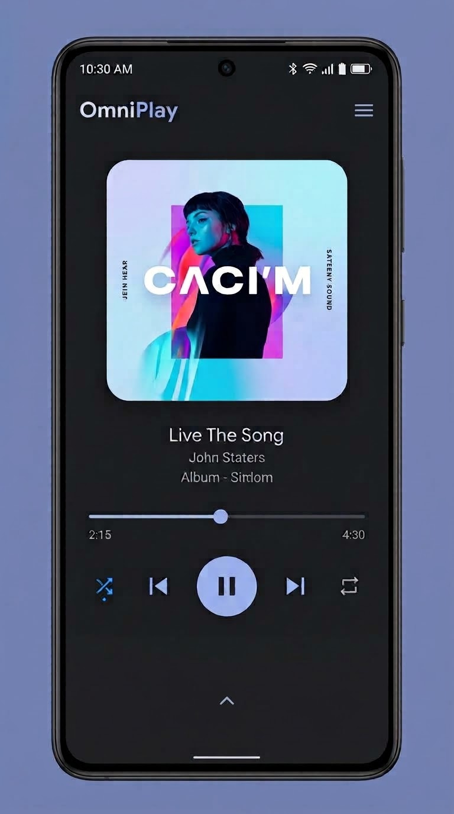

# Omniplay

**Omniplay** is a lightweight, modern, open-source Android music player crafted with Material You (Material 3) design principles.



## Features

- **Material You Design**: Clean dark/AMOLED UI inspired directly by modern Android design aesthetics.
- **Instant Launch**: Starts directly on the Now Playing screen without extra splash screens or gimmicks.
- **Wide Audio Format Support**: Plays **MP3, WAV, FLAC, AAC, M4A, OGG, OPUS, AMR, MIDI**, and other popular audio formats.
- **High-Performance Audio Engine**: Built with native Android `MediaPlayer` and `MediaSessionCompat` for lock screen controls, notification playback controls, audio focus handling (auto-pause on calls or disconnects), and headset media button support.
- **Built-in Equalizer & Audio FX**: 5-band equalizer, Bass Boost, and Virtualizer (3D Surround sound).
- **Expandable Queue & Library**: Swipe up or tap the upward chevron (`^`) to view, search, and manage your track queue and library.
- **Sleep Timer**: Automatically stops playback after 15, 30, 45, or 60 minutes.
- **Ultra-Small APK Size**: Aggressively optimized using custom ProGuard and R8 rules with resource shrinking and ABI splits.
- **Multi-Architecture Support**: Built for `armeabi-v7a` (armv7), `arm64-v8a` (armv8), `x86`, `x86_64`, and Universal APK.

## Open Source Signing Key

This project is fully open source. The release `.jks` signing key is included in the repository:
- **Keystore**: `omniplay.jks`
- **Keystore Password**: `omniplay123`
- **Key Alias**: `omniplay`
- **Key Password**: `omniplay123`

## CI / CD & Artifact Releases

GitHub Actions workflow (`.github/workflows/build.yml`) builds all target architectures upon push to `main` and releases APKs as artifacts:
- `app-arm64-v8a-release.apk`
- `app-armeabi-v7a-release.apk`
- `app-x86-release.apk`
- `app-x86_64-release.apk`
- `app-universal-release.apk`

## Building Locally

```bash
# Clone the repository
git clone https://github.com/mininxd/omniplay.git
cd omniplay

# Build release APKs
./gradlew assembleRelease
```
APKs will be located in `app/build/outputs/apk/release/`.

## License

This project is open-source under the Apache 2.0 / GNU General Public License.
