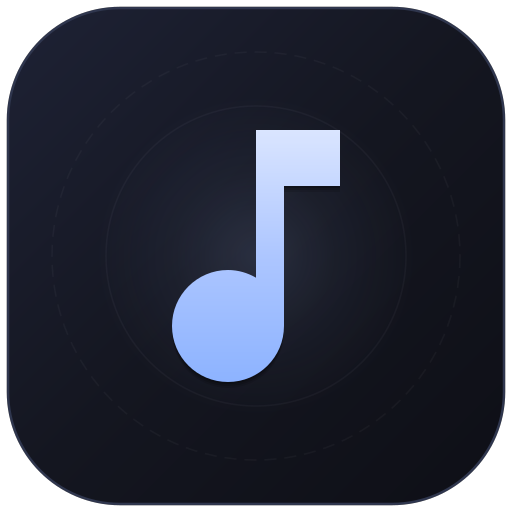

<p align="center">
  
</p>

<h1 align="center">Omniplay</h1>

<p align="center">
  <strong>Fast, lightweight, and modern local music player for Android.</strong>
</p>

Omniplay is designed with Material 3 (Material You) styling, offering smooth gesture navigation, a lively Android 13/14 native squiggly waveform scrubber, and great compatibility across all Android versions from Android 5.0 to Android 14.

---

## ⚡ Key Features

- **🌊 Squiggly Waveform Seek Bar (Android 13/14 Style)**:
  - An animated squiggly wave flows along the progress bar while music is playing.
  - Automatically straightens into a smooth guide line when scrubbing for accurate seeking.
  - Floating timestamp bubble indicator shows the exact time position right above your finger.

- **💿 Interactive Gesture Album Art Peeking**:
  - **Swipe Left / Right Preview**: Drag the album cover horizontally to peek at the next or previous song without stopping your current playback.
  - **Smart Title & Artist Preview**: Swiping left to see the **Next** track displays its title, artist, and artwork right along the revealed edge; swiping right shows the **Previous** track on the left.
  - **Accidental Skip Protection**: If you change your mind and drag the card back, it snaps back smoothly without changing songs. List boundaries also provide natural resistance.
  - **Reliable Song Skipping**: Flinging or dragging past 35% smoothly switches to that song with perfectly synced music and album cover art.
  - **Tap to Open Queue**: Simply tap the album cover to expand the queue sheet.

- **📑 Slide-Up Queue**:
  - A persistent sliding queue panel that slides up from below the controls whenever you want to pick a song.
  - Drag up or down with your finger smoothly, or press the back button to collapse it.
  - Clean vinyl record jacket placeholders with a clear musical note icon centered on the disc label.
  - Easily toggle between custom file album art and uniform disc covers in the menu.

- **⚙️ Smooth & Reliable Playback**:
  - Seamless background playback with lock screen and notification controls.
  - Fully synchronized notification seek bar that matches your track progress without lagging or drifting.
  - Automatic audio management: automatically pauses during phone calls and when headphones are unplugged.
  - Full Shuffle and Repeat modes (Repeat Off, Repeat All, Repeat One).

- **📁 Supported Formats & Music Folders**:
  - **Audio Formats**: MP3, WAV, FLAC, AAC, M4A, OGG, OPUS, and more.
  - **Folder Selection**: Easily pick your music folder from internal storage or an SD card with one tap, and rescan anytime.

- **📱 Modern & Legacy Android Support**:
  - **`app_release.apk` (Modern)**: For devices running Android 8.0 and newer. Features Material You dynamic colors that match your device's wallpaper.
  - **`app_release_legacy.apk` (Legacy)**: For older phones running Android 5.0 to 7.1. Features a classic Dark Teal Material look so older devices can play music smoothly.

---

## 🏗️ Technical Details

| Property | Details |
| :--- | :--- |
| **Language** | Kotlin |
| **Target Version** | Android 14 (API 34) |
| **Modern Build** | Android 8.0+ (API 26+) • Material You |
| **Legacy Build** | Android 5.0–7.1 (API 21–25) • Classic Material 2 |
| **Supported Devices** | ARM phones and tablets (`arm64-v8a`, `armeabi-v7a`) |
| **Core Libraries** | AndroidX, Material Components, Kotlin Coroutines |
| **Audio Engine** | Android native MediaPlayer & MediaSession |
---

## 🚀 Downloads & Releases

GitHub Actions automatically builds two ready-to-install APK files on every update:

- **`app_release.apk`**: For Android 8.0 and newer (Material You)
- **`app_release_legacy.apk`**: For older Android 5.0 to 7.1 devices (Material 2)

---

## 🛠️ Building From Source

```bash
# Clone the repository
git clone https://github.com/mininxd/omniplay.git
cd omniplay

# Build release APKs
./gradlew assembleRelease
```

Generated APKs will be located in `app/build/outputs/apk/release/`:
- `app-modern-release.apk` → `app_release.apk`
- `app-legacy-release.apk` → `app_release_legacy.apk`

---

## 📄 License

Omniplay is open-source software licensed under the [Apache License 2.0](LICENSE).
